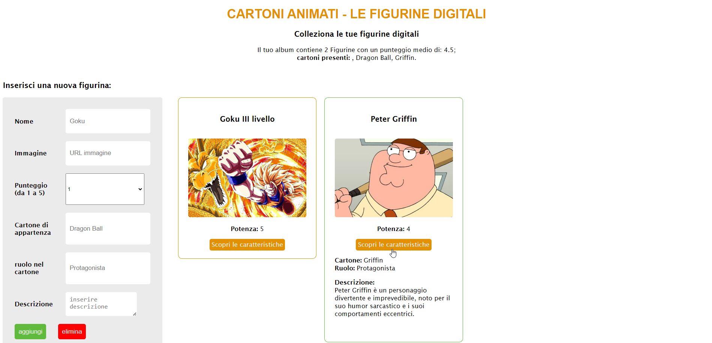

# Cards collection Exercise with javascript objects

## Description

This is an exercise that simulates a collection of collectible cards by insertion using javascript objects
(ita)
Questo è un esercizio che simula una collezione di cards collezionabili tramite inserimento usando gli oggetti di javascript

## Technologies used
The web app was developed using the following technologies:

- HTML
- CSS
- JavaScript

## How to install

To install the web app, follow the following steps:

1. Clone the repository from GitHub to your computer.
6. Open the index.html file in your browser.

## How to contribute

If you want to contribute to this project, you can perform the following actions:

1. Fork the repository
2. Create a new branch with your user name
3. Make the necessary changes
4. Push the changes to your fork
5. Create a pull request

## Crediti
Questo progetto-esercizio è stato creato da Gianpiero Ferraro.(https://www.linkedin.com/in/gianpiero-ferraro/)
